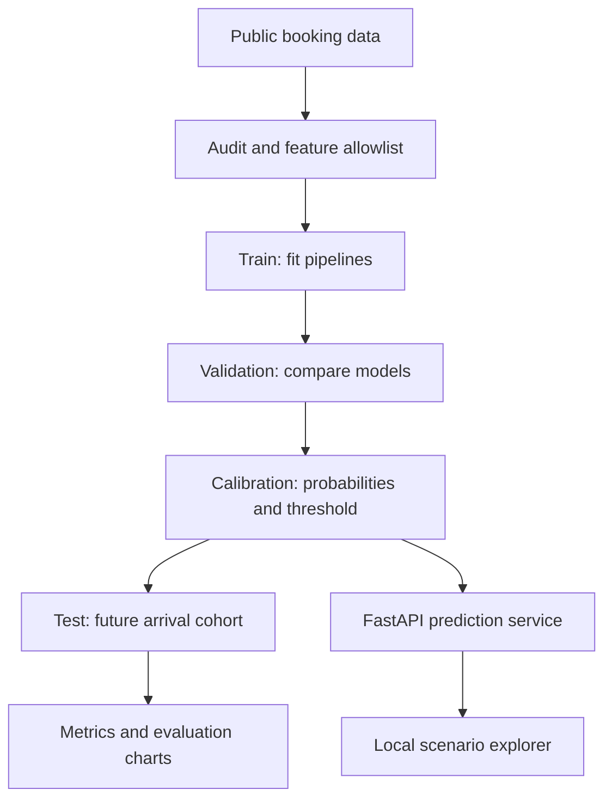

<p align="center"></p>

<p align="center">
<a href="https://github.com/The7areth/hotel-cancellation-ml/actions/workflows/ci.yml"></a>


</p>

<p align="center"><a href="#quick-start">Run locally</a> · <a href="#results-you-can-inspect">Results</a> · <a href="docs/METHODOLOGY.md">Methodology</a> · <a href="docs/MODEL_CARD.md">Model card</a> · <a href="notebooks/01_explore.ipynb">Notebook</a></p>

## The business question

**Which reservations deserve a closer look before a cancellation disrupts planning?**

This project studies that question using real historical hotel bookings. It compares traditional classifiers, separates model ranking from operational decisions, and exposes the selected model through a small prediction app. The business motivation comes from tourism operations; the data is public and contains no employer information.

> **Read the scope correctly:** this is a retrospective arrival-cohort study. The source uses near-arrival snapshots, so the results do not validate prediction at initial booking, current hotel performance, or revenue savings.

## What makes the project useful

| Engineering choice | Why it matters |
|---|---|
| Explicit predictor allowlist | Keeps outcome and selected late-lifecycle fields out of the model |
| Four chronological cohorts | Separates fitting, model selection, calibration and final evaluation |
| Baseline + three classifiers | Establishes whether model complexity improves ranking |
| Probability calibration | Tests probability quality as well as classification |
| Review threshold analysis | Makes the cost of missed cancellations and false alerts visible |
| Reproducible reports and tests | Lets reviewers inspect the evidence behind the claims |

## Results you can inspect

**Selected model: random forest**, based on validation average precision. The final test cohort contains **32,718 bookings**, with a **40.1% cancellation rate**.

| Ranking / probability metric | Held-out test result |
|---|---:|
| ROC AUC | **0.766** |
| Average precision | **0.716** |
| Brier score — lower is better | **0.190** |

| Decision policy | Accuracy | Precision | Cancellation recall |
|---|---:|---:|---:|
| Always predict no cancellation | 59.9% | 0% | 0% |
| Threshold 0.50 | **69.0%** | **60.8%** | 63.8% |
| Review threshold 0.21 | 59.5% | 49.8% | **91.2%** |

The review threshold catches more cancellations but produces **12,077 false alerts**. It uses an illustrative five-to-one missed-cancellation penalty, not measured financial costs. A real deployment must account for review capacity and intervention effectiveness.

<p align="center"></p>

[Full metrics and cohort counts](reports/metrics.json) · [Feature importance](reports/feature_importance.csv) · [Validation comparison and uncertainty](docs/METHODOLOGY.md)

## Quick start

Use **Python 3.12**. Source is public; download the dataset and train the model locally. No paid API, LLM or credentials are required.

```bash
git clone https://github.com/The7areth/hotel-cancellation-ml.git
cd hotel-cancellation-ml
python3 -m venv .venv
source .venv/bin/activate
python -m pip install -r requirements-dev.txt
python -m src.download
python -m src.train
python -m uvicorn app.main:app --reload
```

Open **http://127.0.0.1:8000** for the demo and **http://127.0.0.1:8000/docs** for the API. On Windows PowerShell, activate with `.venv\Scripts\Activate.ps1`.

The demo lets you edit reservation details, inspect an estimated probability, and see whether it crosses the review threshold. It does not modify reservations or send customer messages.

```bash
curl -X POST http://127.0.0.1:8000/predict \
  -H 'Content-Type: application/json' \
  -d '{"hotel":"City Hotel","lead_time":90,"arrival_month":7,"adults":2,"stays_in_week_nights":3,"stays_in_weekend_nights":1}'
```

Unspecified fields use documented demo defaults in the API schema. Supply and audit all fields in an actual integration. `/health` reports whether a trained model is present; `/api/metrics` exposes the measured report.

## How it works



The base model is frozen after validation selection. Calibration and threshold selection share a separate calibration cohort; final-test data is not used for either. Preprocessing is fit only on training data. See [the full methodology](docs/METHODOLOGY.md) for the timing caveats and exact feature decisions.

## Explore the repository

| Location | Contents |
|---|---|
| [`src/`](src) | Data download, feature engineering, model training and evaluation |
| [`app/`](app) | FastAPI service and responsive local demo |
| [`notebooks/01_explore.ipynb`](notebooks/01_explore.ipynb) | Starter EDA and questions to investigate |
| [`reports/`](reports) | Measured metrics, plots and permutation importance |
| [`tests/`](tests) | Input validation, leakage boundaries, cohort rules and inference tests |
| [`docs/MODEL_CARD.md`](docs/MODEL_CARD.md) | Intended use, limitations and validation gaps |
| [`docs/DEMO.md`](docs/DEMO.md) | A two-minute demonstration script |

## Verification

```bash
# After training: includes actual model-loading and inference tests
python -m pytest -q

# Source-only contract checks, used by GitHub Actions
python -m pytest -q -k 'not live_model'
```

Five local tests passed with the trained model. CI deliberately runs source-only tests because model binaries and raw data are not committed. Training produces `models/cancellation.joblib`, reports and optional prediction exports. Only deserialize trusted model artifacts.

To run the included Docker configuration **after training**:

```bash
docker build -t hotel-cancellation-ml .
docker run --rm -p 127.0.0.1:8000:8000 hotel-cancellation-ml
```

Docker configuration is provided but was not built/tested in this environment. The API is unauthenticated and intended for local exploration.

## Limitations and next experiments

- Two historical Portuguese hotels do not establish generalization to other properties or markets.
- Near-arrival snapshots cannot recover initial booking-time feature values.
- Identical rows are retained because there is no unique booking ID proving they are errors.
- Arrival-day bootstrap intervals only partially account for dependent bookings.
- Permutation importance measures associations, not causal impact or local SHAP explanations.
- Next: timestamped booking-creation data, independent hotel validation, capacity-aware policies and prospective shadow evaluation.

## Data credit

António, N., de Almeida, A., & Nunes, L. (2019). **Hotel booking demand datasets.** *Data in Brief, 22*, 41–49. [DOI: 10.1016/j.dib.2018.11.126](https://doi.org/10.1016/j.dib.2018.11.126).

Downloaded from the [TidyTuesday 2020-02-11 mirror](https://github.com/rfordatascience/tidytuesday/tree/master/data/2020/2020-02-11). The source SHA-256 is recorded in the report. Raw data is not republished here; retain original attribution and source terms when using it.

---

Built by [Hareth Al Fawaz](https://github.com/The7areth) · Python, machine learning, and practical business systems
