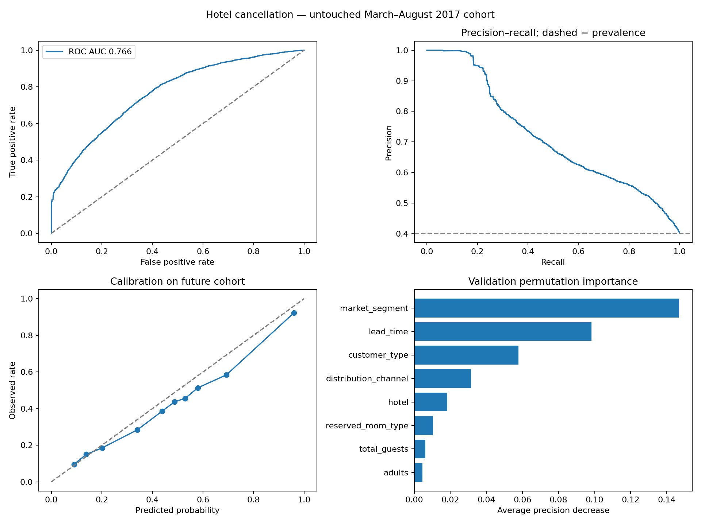

# Hotel Cancellation ML

A reproducible traditional machine-learning portfolio project for hotel cancellation risk: real historical bookings, explicit feature exclusions, chronological cohorts, model comparison, probability calibration, threshold selection, validation permutation importance, and a FastAPI demo.

**Scope:** a retrospective study of two Portuguese hotels. The dataset uses near-arrival snapshots; it does **not** validate deployment at booking creation. A probability shown by the demo is a historical-model estimate, not a guaranteed live risk.

## Start the included trained demo

Use Python 3.12. The downloadable project package includes the trained model and measured reports. From the project directory:

```bash
python3 -m venv .venv
source .venv/bin/activate
python -m pip install -r requirements-dev.txt
python -m uvicorn app.main:app --reload
```

Open http://127.0.0.1:8000. API documentation: http://127.0.0.1:8000/docs.
If you obtained source without the model, train it first:

```bash
python -m src.download
OMP_NUM_THREADS=2 OPENBLAS_NUM_THREADS=2 python -m src.train
python -m pytest -q
```

On Windows, activate `.venv\Scripts\Activate.ps1` and run `python -m src.train` without the environment-variable prefix.

```bash
curl -X POST http://127.0.0.1:8000/predict -H 'Content-Type: application/json' -d '{"hotel":"City Hotel","lead_time":90,"arrival_month":7,"adults":2,"stays_in_week_nights":3,"stays_in_weekend_nights":1}'
```

Unspecified fields have explicit demo defaults; real integrations must supply and audit all fields. The API rejects invalid values and extra columns, including outcome fields. It never changes bookings or sends messages.

## Data and timing

Source: António, N., de Almeida, A., and Nunes, L. (2019), [Hotel booking demand datasets](https://doi.org/10.1016/j.dib.2018.11.126), Data in Brief 22, 41–49. Download mirror: [TidyTuesday, 2020-02-11](https://github.com/rfordatascience/tidytuesday/tree/master/data/2020/2020-02-11). The original article is open access under CC BY; preserve attribution and review source terms when redistributing data. Raw data is downloaded separately and excluded from this package/repository.

119,390 records; 825 zero-guest or zero-night observations excluded from this overnight-stay scope. Four missing child counts are imputed inside the model pipeline. Exact duplicate rows are retained because there is no booking ID proving that they are data errors; they may represent distinct or group bookings. This dependence limits effective sample size. The downloaded-file SHA-256 is recorded in `reports/metrics.json`.

| Cohort | Scheduled arrival dates | Rows | Purpose |
|---|---|---:|---|
| Train | Jul 2015–Sep 2016 | 63,293 | Fit preprocessing and base models |
| Validation | Oct–Dec 2016 | 13,969 | Choose model by average precision |
| Calibration | Jan–Feb 2017 | 7,491 | Sigmoid calibration and threshold selection |
| Test | Mar–Aug 2017 | 32,718 | Final evaluation only |

Rows whose status dates extend beyond the next cohort boundary are purged from train, validation and calibration. Status dates are split metadata only, never predictors. These are arrival-cohort splits, **not** reconstructed booking-creation splits. They test transfer to later arrival cohorts but cannot establish what was known at initial booking. Cancellations occurring before arrival remain in the historical target; this is not a prospective day-before-arrival risk set either.

## Leakage and predictor choices

An explicit allowlist in `src/features.py` prevents arbitrary columns from entering the model. Excluded: cancellation outcome, reservation status/date, assigned room, booking changes, deposit type, ADR, waitlist days, parking and special requests, country, agent/company IDs and previous-booking counts. Some could be valid at a documented operational prediction time, but are omitted here to reduce temporal ambiguity or identity proxy dependence.

Used: hotel, lead time, arrival month, planned stay lengths, party counts, repeat-guest indicator, meal, market segment, distribution channel, reserved room and customer type. Total nights and total guests are engineered. **Even these can change during the booking lifecycle**: without creation-time snapshots, feature exclusion alone cannot establish leakage-free booking-time prediction.

Numerical missing values use training medians and standard scaling. Categories use training modes and one-hot encoding with unknown-category handling. All preprocessing is fit only on train inside a Pipeline.

## Measured model comparison

Selection uses validation average precision, not the final test results. No random row split or test-set hyperparameter search is used.

| Model | Validation ROC AUC | Validation average precision |
|---|---:|---:|
| Prior baseline | 0.500 | 0.397 |
| Logistic regression | 0.731 | 0.694 |
| Random forest | 0.772 | 0.728 |
| Histogram gradient boosting | 0.768 | 0.720 |

Random forest is selected and frozen. A sigmoid calibrator is fit on the later calibration cohort. The base model is not refit after selection. The same calibration cohort also selects the review threshold; this is a limitation for calibration-cohort claims, while the final test stays separate. Candidate hyperparameters are fixed and recorded in source; this version is model comparison, not an extensive tuning study.

## Untouched test results

Test cancellation prevalence: **40.1%**. Selected model ROC AUC: **0.766**; average precision: **0.716**; calibrated Brier score: **0.190**. Average precision is reported directly, not mislabeled as a trapezoidal PR AUC.

| Policy | Accuracy | Precision | Cancellation recall | F1 |
|---|---:|---:|---:|---:|
| Always not canceled | 59.9% | 0% | 0% | 0 |
| Probability >= 0.50 | 69.0% | 60.8% | 63.8% | 0.623 |
| Review threshold >= 0.21 | 59.5% | 49.8% | 91.2% | 0.644 |

The 0.21 threshold minimizes **illustrative** penalties on the calibration cohort: a missed cancellation costs five units, a false alert one. These are not estimated financial savings or actual business costs. At this threshold, the test set contains 11,965 true alerts, 12,077 false alerts, 1,161 missed cancellations and 7,515 true negatives. Flagging does not itself prevent cancellation, and the volume may exceed a team's capacity.

200 arrival-day cluster bootstrap replicates give an approximate test ROC-AUC interval **0.753–0.783** and average-precision interval **0.682–0.752**. This addresses within-day dependence partially; it does not address dependence across days, repeated customers, hotel-level uncertainty or representativeness outside these two hotels.



Global explanations use **validation permutation importance**, not SHAP. The measure is decrease in validation average precision after shuffling a column. Correlated and derived columns can mask one another; values are predictive associations, not causal effects. No invented per-booking percentage explanations are shown.

## Files and verification

- `src/features.py`: feature allowlist, engineering, cleaning and cohort definitions.
- `src/train.py`: four baselines, validation selection, calibration, threshold, test evaluation and plots.
- `reports/metrics.json`: complete results, dataset fingerprint, hotel-specific scores and bootstrap intervals.
- `reports/feature_importance.csv`: validation permutation importance.
- `notebooks/01_explore.ipynb`: starter EDA with reproducible cells.
- `app/`: browser scenario form and FastAPI prediction service.
- `tests/`: predictor leakage protection, date-boundary purging, API validation, prediction contract and actual model inference.

**Five local tests passed**, including actual model loading and inference. The CI definition tests source contracts without a committed model. Docker configuration is included but the image has not been built/tested here. Only load trusted joblib artifacts: deserialization is unsafe for untrusted files.

## Before deployment

Collect permissioned creation-time snapshots and outcomes from the intended hotels; define the prediction horizon; handle right-censoring; group customers/bookings to prevent leakage; independently validate on another property/time period; measure calibration drift and intervention costs/capacity. Authentication, monitoring, data governance and prospective shadow evaluation are still needed. The local API has no authentication: keep it bound to localhost. No claims about Syrian hotels, revenue uplift or prevented cancellations are made.
